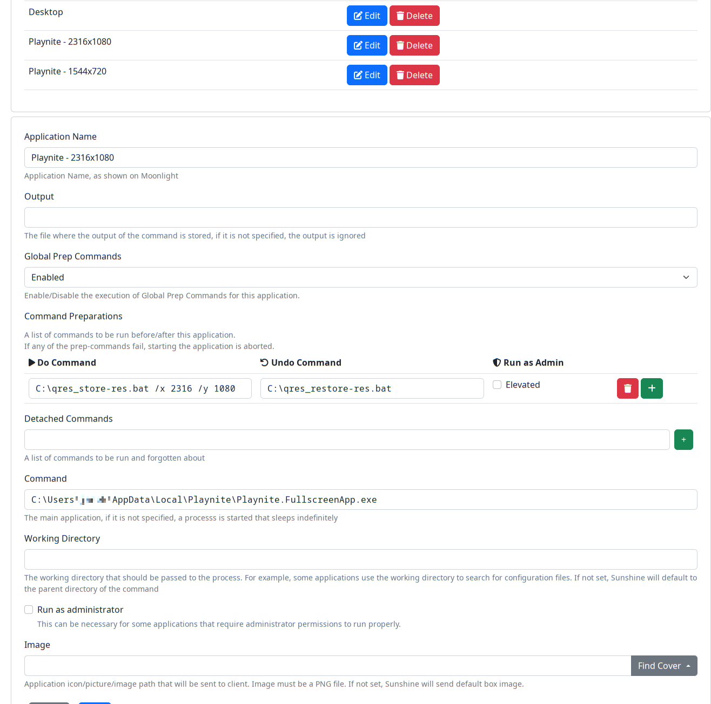

`libvirt/qemu.d -> /etc/libvirt/hooks/qemu.d`

---

Sunshine config

---

Reset bug arcane workaround:\
`echo 1 | sudo tee /sys/bus/pci/devices/0000:01:00.0/remove && echo 1 | sudo tee /sys/bus/pci/rescan
`\
<- run twice after every reboot